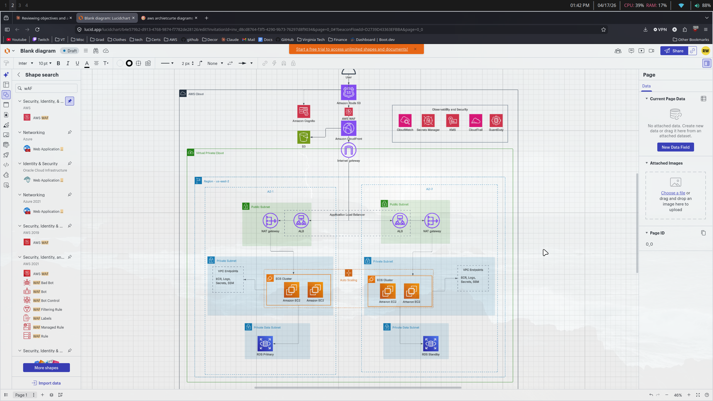

# MaroonLedger

*A production-grade personal finance platform on AWS — built to develop hands-on expertise across cloud engineering, DevOps, security, and networking.*

**MaroonLedger** is an end-to-end cloud engineering project that implements a production-grade personal finance platform on AWS. It demonstrates realistic cloud capabilities including secure user authentication and data storage, full CRUD operations over a relational database, and a scalable, highly available infrastructure deployed across multiple Availability Zones.

This project was built to demonstrate hands-on experience with the full AWS service ecosystem — from networking and container orchestration to identity, observability, and infrastructure-as-code — in a realistic, resume-ready portfolio piece

---------------------------------------------------------------------------------------------------

## Architecture

