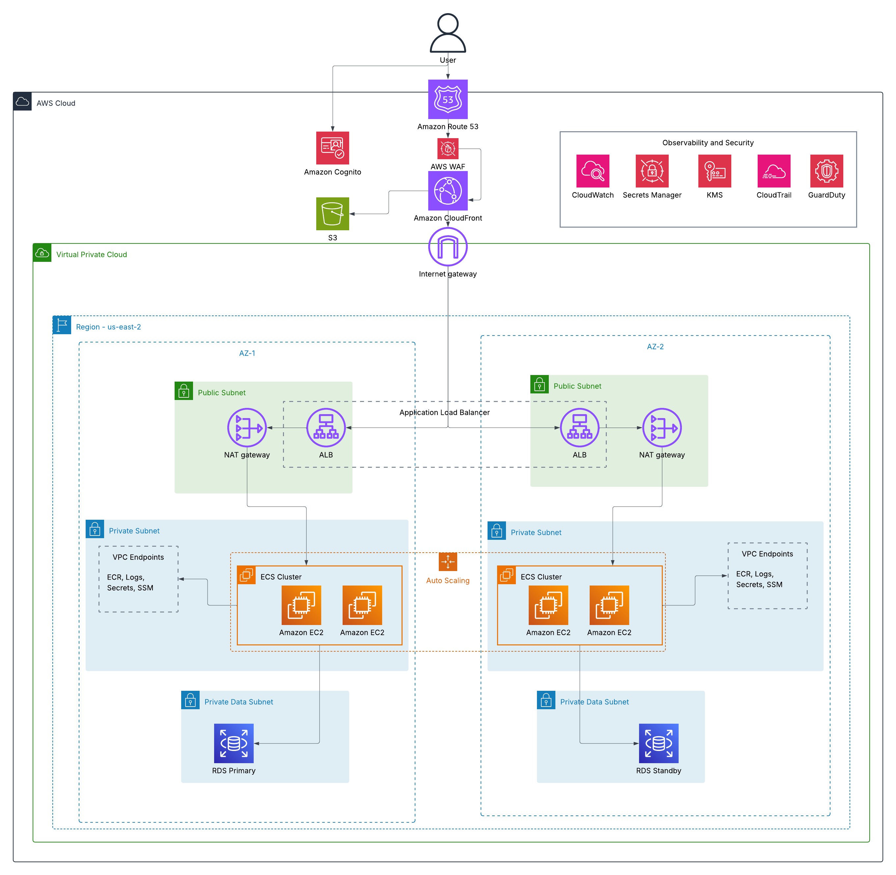

# MaroonLedger

*A production-grade personal finance platform on AWS — built to develop hands-on expertise across cloud engineering, DevOps, security, and networking.*

**MaroonLedger** is an end-to-end cloud engineering project that implements a production-grade personal finance platform on AWS. It demonstrates realistic cloud capabilities including secure user authentication and data storage, full CRUD operations over a relational database, and a scalable, highly available infrastructure deployed across multiple Availability Zones.

This project was built to demonstrate hands-on experience with the full AWS service ecosystem — from networking and container orchestration to identity, observability, and infrastructure-as-code — in a realistic, resume-ready portfolio piece

---------------------------------------------------------------------------------------------------

# Architecture

# Architecture Walkthrough

## Layer 1: DNS & Edge

This layer is the public entry point for the application: resolving the domain, serving content from edge locations, and filtering malicious traffic before it reaches the VPC. It's made up of three services: **Amazon Route 53**, **Amazon CloudFront**, and **AWS WAF**.

### Amazon Route 53

**What it is.** AWS's managed DNS service, backed by a 100% uptime SLA.

**Role in this architecture.** Route 53 hosts the authoritative DNS records for the app's domain and resolves user requests to the CloudFront distribution using an alias record.

**Why this choice.** Alias records resolve directly to AWS resources without the extra hop of a standard DNS lookup, and Route 53 integrates cleanly with Cognito, CloudFront, and ACM. It also supports health checks and failover routing if the project ever goes multi-region.

### Amazon CloudFront

**What it is.** AWS's global CDN, delivering content from 400+ edge locations close to end users.

**Role in this architecture.** CloudFront is the single public entry point for all traffic. It serves the static frontend from an S3 origin and forwards `/api/*` requests to the ALB origin via path-based routing. TLS is terminated at the edge using an ACM certificate in `us-east-1`.

**Why this choice.** One distribution in front of both origins gives a unified domain, edge caching for static assets, and a single attachment point for WAF. It also includes AWS Shield Standard for free, providing baseline DDoS protection at the edge.

### AWS WAF

**What it is.** A managed Web Application Firewall that inspects HTTP/HTTPS requests and blocks anything matching its rule sets.

**Role in this architecture.** WAF attaches to the CloudFront distribution via a Web ACL, evaluating every request at the edge. Attacks get blocked before they reach S3 or the ALB, and both origins are protected under one policy.

**Why this choice.** Edge-deployed WAF rejects attacks closer to the source and benefits from CloudFront's caching, which lowers evaluation volume and cost. It also layers cleanly with Shield Standard for volumetric protection.

## Layer 2: Identity

This layer handles user authentication and session management, sitting alongside the edge layer as part of the user-facing surface. It's built around a single service: **Amazon Cognito**.

### Amazon Cognito

**What it is.** AWS's managed identity service, providing user directories, authentication flows, and token issuance via OAuth 2.0 and OIDC.

**Role in this architecture.** Cognito is the first thing a user interacts with. A Cognito User Pool handles sign-up, sign-in, password resets, and MFA enrollment through Cognito's Hosted UI, and issues a JWT on successful authentication. The frontend attaches that JWT to API calls, and the ECS tasks validate it against Cognito's JWKS endpoint before serving the request.

**Why this choice.** Cognito removes the need to build and maintain a custom auth stack — password hashing, session storage, MFA, token rotation, account recovery — while still integrating natively with the rest of the AWS ecosystem. The Hosted UI handles the login page out of the box, removing the need to implement Cognito's SRP auth flow in the frontend.

## Layer 3: Networking

This layer defines the virtual network that hosts all application and data resources. It follows industry-standard patterns for isolation, least-privilege egress, and high availability — a multi-tier VPC spanning two Availability Zones, with public-facing and private resources separated by subnet boundaries and traffic flow controlled at the route-table level.

### VPC & Regional Layout

**What it is.** A Virtual Private Cloud (VPC) is a logically isolated section of the AWS network where resources run inside a user-defined IP range.

**Role in this architecture.** A single VPC deployed in `us-east-2` hosts all compute and data resources. The VPC uses a `/16` CIDR block (`10.0.0.0/16`), leaving room for future subnet expansion.

**Why this choice.** A `/16` CIDR is the standard starting point for a multi-AZ, multi-tier architecture — it provides 65,536 usable addresses, more than enough for future growth, and aligns cleanly with the `/20` subnets used beneath it. `us-east-2` was chosen for its maturity, availability zone count, and proximity to the intended user base.

### Subnet Tiers

**What it is.** Subnets partition the VPC's IP range into smaller segments, each scoped to a single Availability Zone.

**Role in this architecture.** The VPC uses a three-tier subnet pattern, repeated across two Availability Zones for high availability:

- **Public subnets** — host the ALB and NAT Gateways; routes to the internet via the IGW.
- **Private-app subnets** — host the ECS tasks on EC2, and VPC Endpoints; no direct internet route.
- **Private-data subnets** — host the RDS primary and standby; fully isolated from the internet.

**Why this choice.** The three-tier pattern enforces separation of concerns at the network layer: only public subnets are reachable from outside the VPC, only private-app subnets can call the database, and the database tier has no route outbound at all. This limits the blast radius of any single compromised resource and aligns with AWS's own reference architectures for web workloads.

### Internet Gateway & NAT Gateways

**What they are.** An Internet Gateway (IGW) is a VPC component that enables two-way communication between the VPC and the public internet. A NAT Gateway allows private subnets to initiate outbound connections to the internet without being reachable from it.

**Role in this architecture.** The IGW attaches to the VPC and routes public traffic to and from the ALB in the public subnets. A NAT Gateway in each public subnet allows ECS tasks in the private-app subnets to pull OS packages and reach services not covered by VPC Endpoints — while blocking all inbound traffic from the internet.

**Why this choice.** Deploying one NAT Gateway per AZ (rather than a single shared one) avoids a cross-AZ data transfer charge and eliminates a single point of failure — if an AZ fails, the other AZ's NAT Gateway keeps outbound traffic flowing.

### Route Tables

**What they are.** Route tables define how traffic is forwarded within the VPC based on destination CIDR.

**Role in this architecture.** Three route tables govern traffic flow:

- **Public route table** — attached to both public subnets; `0.0.0.0/0` routes to the IGW.
- **Private-app route table** — attached to both private-app subnets; `0.0.0.0/0` routes to the NAT Gateway in the same AZ.
- **Private-data route table** — attached to both private-data subnets; no `0.0.0.0/0` route, meaning no internet access in either direction.

**Why this choice.** Per-AZ private-app route tables ensure outbound traffic stays within its source AZ, avoiding cross-AZ data transfer costs. Removing the default route entirely from the private-data tier is what actually makes the database tier "isolated" — subnet labels are descriptive, but route tables are what enforce the isolation.

### VPC Endpoints

**What they are.** VPC Endpoints provide private connectivity from inside a VPC to AWS service APIs, without traversing the public internet. Interface endpoints are ENI-based; Gateway endpoints are route-table-based.

**Role in this architecture.** Interface endpoints for ECR (API + Docker), CloudWatch Logs, Secrets Manager, and SSM are deployed in each private-app subnet, allowing ECS tasks to pull container images, ship logs, and retrieve secrets without routing through the NAT Gateway. A Gateway endpoint for S3 is attached to the private-app route tables for the same reason.

**Why this choice.** Keeping AWS API traffic inside the VPC reduces NAT Gateway data processing charges (a real cost at scale), eliminates dependency on internet reachability for core AWS service calls, and improves the security posture by keeping sensitive traffic — like secret retrieval — off the public internet entirely.

## Layer 4: Compute

This layer runs the application itself. It sits inside the private-app subnets of the VPC and receives traffic exclusively from the ALB, which terminates user requests forwarded by CloudFront. The layer is built from three components: the **Application Load Balancer**, the **ECS cluster running on EC2**, and the **Auto Scaling Group** that manages the underlying instances.

### Application Load Balancer (ALB)

**What it is.** A Layer 7 load balancer that routes HTTP/HTTPS traffic to backend targets based on path, host, or header rules.

**Role in this architecture.** The ALB is deployed across both public subnets with one node per Availability Zone, giving it a presence in each AZ for high availability. It accepts HTTPS traffic from CloudFront on port 443 using an ACM-issued certificate, terminates TLS, and forwards plaintext HTTP to the ECS tasks in the private-app subnets via a target group. Health checks on the target group determine which tasks are eligible to receive traffic.

**Why this choice.** An ALB is the right fit for HTTP-based workloads — it supports path-based routing, native integration with ECS, and health-check-driven traffic shaping, none of which the simpler Network Load Balancer provides. Terminating TLS at the ALB (rather than end-to-end TLS into the tasks) keeps certificate management in one place and keeps intra-VPC traffic simple. Restricting inbound on the ALB to the CloudFront origin-facing prefix list ensures the ALB can't be hit directly, preserving the edge-attached WAF as the only real entry point.

### Elastic Container Service (ECS) on EC2

**What it is.** ECS is AWS's managed container orchestration service. In the EC2 launch type, the ECS control plane schedules tasks onto EC2 instances registered as container hosts in the cluster.

**Role in this architecture.** A single ECS cluster runs the application's containerized workload across both private-app subnets. Tasks are defined by a task definition specifying the container image (pulled from ECR), CPU/memory reservations, environment variables, and the IAM task role that grants permissions to retrieve secrets from Secrets Manager and ship logs to CloudWatch. An ECS service maintains the desired task count, replaces unhealthy tasks automatically, and registers healthy tasks with the ALB's target group.

**Why this choice.** ECS on EC2 was chosen over Fargate to demonstrate familiarity with cluster capacity management — sizing instances, managing the ASG, handling container placement — which is a frequent expectation for cloud engineering roles. It also gives finer control over instance types and reserved-instance pricing, which matters more at scale. Fargate would simplify operations but would remove an entire layer of the stack from the learning surface.

### Auto Scaling Group (ASG)

**What it is.** An ASG manages a fleet of EC2 instances, maintaining a target instance count and replacing unhealthy instances automatically based on launch template and scaling policies.

**Role in this architecture.** The ASG spans both private-app subnets and manages the EC2 instances that host the ECS tasks. Instances launch from a hardened launch template using an ECS-optimized AMI, register themselves with the ECS cluster on boot, and are distributed across both AZs for resilience. A target tracking scaling policy adjusts the instance count based on cluster CPU reservation, adding capacity when tasks can't be placed and removing it when capacity is underused.

**Why this choice.** The ASG provides both the resilience guarantee (unhealthy instances are replaced without intervention) and the elasticity guarantee (capacity follows demand). Spanning both AZs means an AZ failure removes only half the fleet, and the ASG will replace those instances in the surviving AZ automatically. Target tracking is preferred over step scaling for this workload because it's simpler to configure and produces smoother capacity curves for steady-state traffic.

## Layer 5: Data

This layer holds the application's persistent state and the sensitive configuration values that support it. It sits in the most tightly-scoped part of the architecture: the private-data subnets, which have no route to the internet in either direction. The layer is built from three components: **Amazon RDS** for the relational database, **Amazon S3** for static frontend assets and object storage, and **AWS Secrets Manager** for credentials and other sensitive values.

### Amazon RDS (PostgreSQL)

**What it is.** RDS is AWS's managed relational database service, handling provisioning, patching, backups, and failover for a choice of database engines.

**Role in this architecture.** A PostgreSQL instance runs in a Multi-AZ configuration, with the primary in one Availability Zone and a synchronous standby in the other. Both instances live in the private-data subnets — a dedicated subnet group scoped to those two AZs — and are reachable only from the ECS tasks via security group reference. The ECS tasks retrieve database credentials from Secrets Manager at startup rather than holding them in environment variables or the container image.

**Why this choice.** Managed RDS eliminates the operational burden of patching, backups, and failover orchestration that would otherwise fall on the team. Multi-AZ is the right availability posture for a stateful tier — synchronous replication guarantees zero data loss on failover, and AWS handles the DNS cutover to the standby automatically within 60–120 seconds. PostgreSQL was chosen over other engines for its feature breadth (JSONB, full-text search, strong constraint support) and its fit with typical financial data modeling. Storage is encrypted at rest with a customer-managed KMS key, and automated backups are retained for seven days with point-in-time recovery enabled.

### Amazon S3

**What it is.** S3 is AWS's object storage service, designed for 11 nines of durability and virtually unlimited capacity.

**Role in this architecture.** S3 serves two purposes. First, a bucket hosts the static frontend bundle (HTML, CSS, JavaScript) and is exposed to users through CloudFront using Origin Access Control, which restricts direct bucket access and forces all reads to go through the distribution. Second, a separate bucket stores application-generated objects such as exported reports or user uploads; the ECS tasks write to this bucket via the S3 Gateway Endpoint attached to the private-app route tables, keeping that traffic inside the VPC.

**Why this choice.** Hosting static assets on S3 behind CloudFront is the canonical AWS pattern for web frontends — it separates static delivery from the application tier, offloads traffic to the edge, and costs a fraction of serving static files from ECS. Using Origin Access Control keeps the bucket private while still allowing CloudFront to read from it. The Gateway Endpoint for the application bucket avoids NAT Gateway data processing charges on S3 traffic, which adds up quickly at scale.

### AWS Secrets Manager

**What it is.** Secrets Manager is AWS's managed service for storing, rotating, and retrieving sensitive configuration values — database credentials, API keys, third-party tokens — encrypted at rest with KMS.

**Role in this architecture.** The RDS master credentials and any third-party API keys live in Secrets Manager, encrypted with a customer-managed KMS key. The ECS task role grants read access to specific secret ARNs, and tasks retrieve the values at container startup via the Secrets Manager VPC Endpoint rather than over the public internet. Automatic rotation is configured for the RDS credential, triggering a Lambda-backed rotation every 30 days without application-side changes.

**Why this choice.** The alternative — hardcoding credentials in environment variables or baking them into container images — is one of the most common sources of credential leakage in cloud applications. Secrets Manager keeps credentials out of source control, out of images, and out of logs, while giving a clear audit trail of every access through CloudTrail. Automatic rotation for RDS is the feature that justifies Secrets Manager over the cheaper SSM Parameter Store, which lacks native rotation support.

## Layer 6: Observability & Operations

This layer covers the services that make the application debuggable, auditable, and defensible in production. None of these services sit in the traffic path — they observe it, record it, and alert on it. The layer is built from four services: **Amazon CloudWatch** for metrics and logs, **AWS CloudTrail** for API-level audit logging, **Amazon GuardDuty** for threat detection, and **AWS KMS** for encryption key management.

### Amazon CloudWatch

**What it is.** CloudWatch is AWS's native monitoring service, combining metrics, logs, alarms, and dashboards into a single platform.

**Role in this architecture.** CloudWatch ingests metrics from every AWS service in the stack — ALB request counts and latencies, ECS task CPU and memory, RDS connection counts and storage, NAT Gateway throughput — and application logs shipped from ECS tasks via CloudWatch Logs. Log groups are scoped per service with 30-day retention for hot storage, and alarms trigger on SLO-relevant thresholds (5xx error rate, ECS task failures, RDS CPU saturation, ALB target health) with notifications routed to an SNS topic.

**Why this choice.** CloudWatch is the default observability surface for AWS workloads, and using it keeps the operational story inside a single service rather than stitching together a third-party stack. Metrics are collected automatically for most services without additional instrumentation, and CloudWatch Logs integrates natively with ECS via the `awslogs` log driver. A production deployment would eventually add Container Insights or a third-party APM tool for deeper tracing, but CloudWatch alone covers the essentials.

### AWS CloudTrail

**What it is.** CloudTrail is AWS's audit service, recording every API call made in the account — who made it, when, from where, and what it changed.

**Role in this architecture.** An organization-wide CloudTrail trail captures all management-plane API activity and delivers it to a dedicated S3 bucket with log file validation enabled. Ninety days of recent activity are queryable directly in the CloudTrail console, and the S3 bucket retains events long-term for compliance. CloudTrail also feeds directly into GuardDuty as one of its primary analysis sources.

**Why this choice.** CloudTrail is the first service a security auditor asks about, and enabling it is effectively required for any production AWS workload. The first trail per account is free, log file validation prevents tampering, and centralizing the S3 destination makes it straightforward to extend into a multi-account setup later. The audit trail is also what makes incident response possible — without it, there's no way to reconstruct who did what during a breach.

### Amazon GuardDuty

**What it is.** GuardDuty is AWS's managed threat detection service, continuously analyzing CloudTrail events, VPC Flow Logs, and DNS query logs to identify malicious or anomalous activity.

**Role in this architecture.** GuardDuty runs in the account with all three log sources enabled, generating findings for patterns such as credential exfiltration, cryptocurrency mining on EC2 instances, communication with known-malicious IPs, and anomalous API call patterns. Findings are categorized by severity (low, medium, high) and routed through EventBridge, with high-severity findings triggering an SNS alert for immediate response.

**Why this choice.** GuardDuty is the AWS-native intrusion detection story, and it's cheap enough (~$3–10/month at this scale) to be a default enable on any account that holds real data. It doesn't replace a full SIEM, but it catches the most common cloud-specific attack patterns — compromised IAM credentials, mining workloads on stolen capacity, reconnaissance from known-bad IPs — without requiring any agent deployment or log pipeline work.

### AWS KMS

**What it is.** KMS is AWS's key management service, creating and managing encryption keys used by virtually every AWS service that supports encryption at rest.

**Role in this architecture.** A customer-managed KMS key encrypts RDS storage and automated backups, S3 bucket contents, Secrets Manager values, EBS volumes on the EC2 container hosts, and selected CloudWatch log groups. Automatic annual rotation is enabled on the key, and key usage is logged to CloudTrail, producing an auditable record of every cryptographic operation.

**Why this choice.** Using a customer-managed key rather than the AWS-managed default provides control over key policies, rotation cadence, and cross-account access — all of which matter in real compliance contexts even when the underlying cryptography is identical. A single key simplifies the encryption story for this project's scope; a production multi-tenant deployment would typically separate keys by data classification or service boundary.

---------------------------------------------------------------------------------------------------
## Security Model

Security in this architecture is built on **defense in depth**: no single control is trusted to protect the system on its own. Each tier enforces its own boundary, each service runs with least-privilege permissions, and sensitive data is protected at every point it's stored or moved.

### Network Isolation

The network enforces least privilege through subnet boundaries, route tables, and **security group chaining**. Rather than referencing IP ranges, each security group references the SG of the tier permitted to call it:

| Security Group | Inbound Source | Port | Purpose |
|---|---|---|---|
| `alb-sg` | CloudFront prefix list | 443 | Accept HTTPS only from CloudFront edges |
| `ecs-sg` | `alb-sg` | 8080 | Accept app traffic only from the ALB |
| `rds-sg` | `ecs-sg` | 5432 | Accept DB traffic only from ECS tasks |
| `vpce-sg` | `ecs-sg` | 443 | Accept endpoint traffic only from ECS tasks |

Each tier trusts only the tier directly above it, which contains the blast radius of any single compromise. Rules reference SGs instead of CIDRs so they adapt automatically as resources scale.

The CloudFront prefix list is the one non-chained source — CloudFront doesn't live in the VPC and has no SG to reference. AWS publishes a managed list of CloudFront's origin IPs, and restricting the ALB to it prevents direct-to-ALB attacks that bypass the edge.

### Identity and Access

User identity is handled by **Cognito**: users authenticate through the Hosted UI, receive a JWT, and the ECS tasks validate that JWT on every request.

Service identity is handled by **IAM roles**, each scoped to the minimum permissions needed. The ECS task role grants specific secret reads, log writes, and S3 access — nothing more. The ECS task execution role is kept separate from the task role so application code can't access permissions meant for the ECS agent (image pulls, log group creation). Keeping these distinct is a standard but frequently-missed ECS practice.

### Data Protection

All data at rest is encrypted with a **customer-managed KMS key** — RDS storage and backups, S3 buckets, Secrets Manager values, and EBS volumes on the container hosts. The key has automatic annual rotation enabled, and every use is logged to CloudTrail.

All data in transit is encrypted with TLS — user to CloudFront (TLS 1.2+ with ACM), CloudFront to ALB (HTTPS-only origin policy), ECS to RDS (`sslmode=require`), and ECS to AWS APIs (native TLS via VPC Endpoints). The one unencrypted segment is ALB to ECS, inside the VPC and inside a trust boundary — adding TLS there would require certificate management in each container for no threat-model improvement.

### Secrets

Application credentials live exclusively in **Secrets Manager**, encrypted with the KMS key, retrieved at container startup via the Secrets Manager VPC Endpoint. Automatic rotation is configured for the RDS credential. No credentials exist in source control, container images, or environment variables.

### Edge Protection

**WAF** is attached to CloudFront via a Web ACL, with managed rule groups covering the OWASP Top 10, known bad inputs, and IP reputation, plus a custom rate-limit rule (2,000 requests per 5 minutes per IP). **Shield Standard** is included automatically and provides baseline DDoS protection at the edge. Edge protection is the first layer, never the only one — the SG chain assumes WAF could be bypassed and still rejects unauthorized traffic at the ALB.

### Audit and Detection

**CloudTrail** records every API call in the account and delivers events to a dedicated S3 bucket with log file validation enabled. **GuardDuty** analyzes those events (plus VPC Flow Logs and DNS logs) for malicious patterns — credential exfiltration, cryptocurrency mining, communication with known-bad IPs — and routes high-severity findings to SNS for response. CloudTrail provides the record; GuardDuty provides the interpretation.

---------------------------------------------------------------------------------------------------

## Tech Stack

- **Go** — backend language. Chosen for its concurrency model, low memory footprint, and fast startup times, all of which play well with containerized workloads on ECS. Also forces explicit error handling and straightforward HTTP server code, both of which matter when the goal is writing production-grade services.
- **React** — frontend framework. The default choice for a modern SPA, served as a static bundle from S3 behind CloudFront. No server-side rendering; the API lives in Go and the frontend is pure client-side.
- **PostgreSQL** — relational database, managed via RDS. Chosen over MySQL for richer type support (JSONB, arrays, full-text search) and stronger constraints — both useful for financial data.

### Infrastructure

- **Terraform** — infrastructure as code. Chosen over CDK for its cloud-agnostic design, mature module ecosystem, and explicit state model — all of which make it the more portable skill across employers. Every AWS resource in this project is declared in Terraform; nothing is created manually in the console.
- **Amazon Linux 2023** — container base image. AWS-maintained, optimized for running on EC2 and ECS, and receives security patches through the AWS update channel. Keeps the base layer small and aligned with the host OS on the container instances.
- **Amazon ECR** — container registry. Private, integrated with ECS task definitions by ARN, and reachable from the VPC via an Interface Endpoint rather than the public internet.

### Supporting Tools

- **Bash** — for repo-local scripting: build wrappers, local Terraform helpers, container entrypoints, and glue around the AWS CLI. Kept minimal and POSIX-compatible where possible.
- **AWS CLI** — for local interaction with the account during development, and for anything not yet managed through Terraform (one-off investigations, manual validation of deployed resources).
- **Git + GitHub** — version control and remote hosting. The repository is structured as a monorepo, with separate top-level directories for the Go backend, the React frontend, and the Terraform configuration.

### Planned Additions

- **GitHub Actions** — CI/CD pipeline for automated builds, tests, container image pushes to ECR, and Terraform plan/apply workflows. Not yet implemented; this is the next major piece of work on the infrastructure side.
