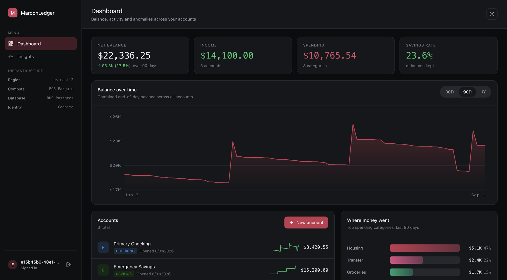
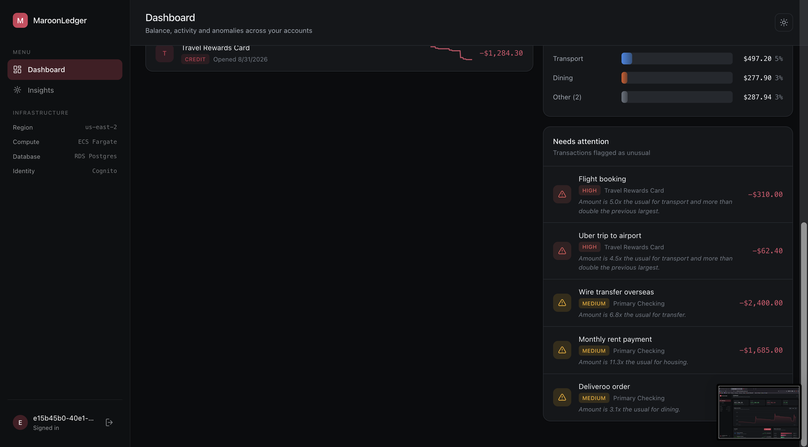
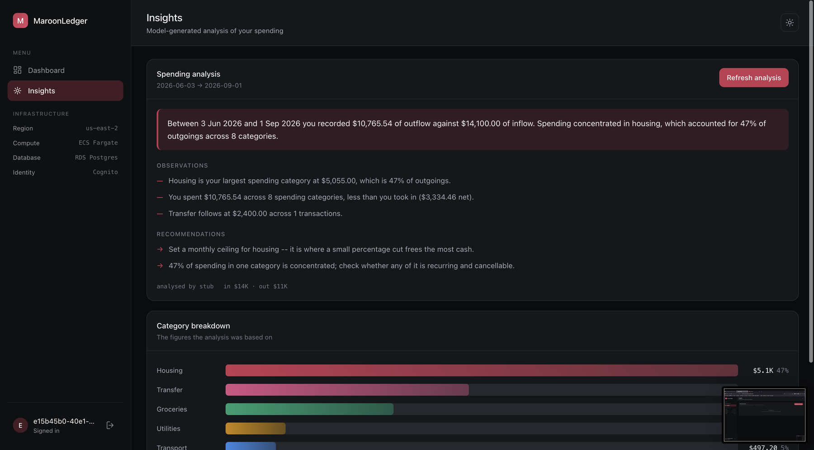
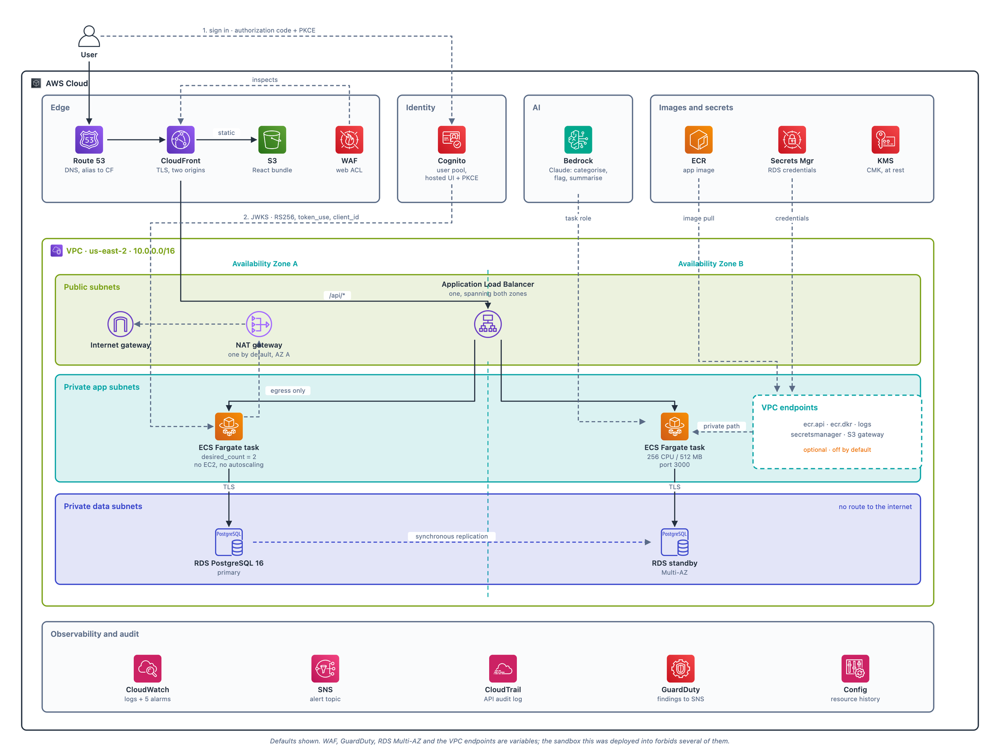
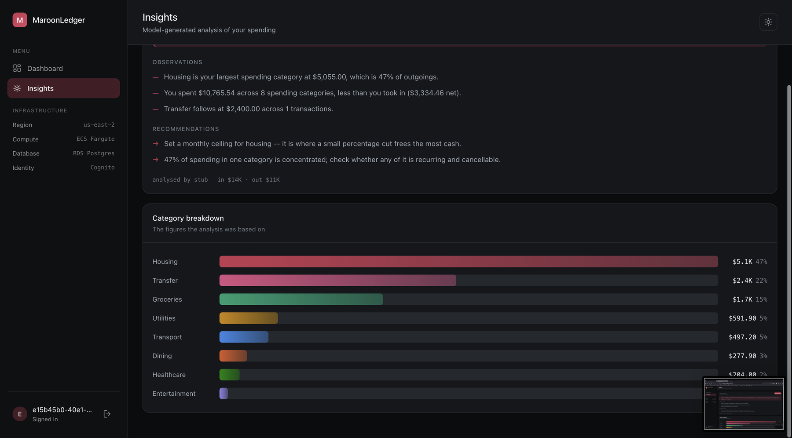

# MaroonLedger

A personal finance application on AWS. Users sign in through Cognito, each
person's data is scoped to their own identity, and Claude on Bedrock categorizes
transactions, flags unusual ones, and writes a spending summary.



## Overview

I started this in April 2026 to learn cloud engineering by building something
real. The infrastructure came first: seven layers of Terraform modules covering
network, data, compute, edge, identity and observability. The first
`terraform apply` created 72 resources. A Go API went on top, containerized and
deployed.

I picked it up again in August expecting to polish the UI. Instead the first
read-through found that my own infrastructure doc described a Cognito identity
layer and an ECS-on-EC2 cluster, and neither existed. The API was open CRUD with
no authentication at all. The second half of the project is mostly about closing
that gap: token verification, per-user data scoping enforced in SQL, an AI layer
with prompt injection in its threat model, a redesigned frontend, and a streaming
analytics pipeline.

`docs/` holds the detail: `infrastructure.md` service by service,
`architecture-inventory.md` mapping diagram boxes to Terraform resources, and
`devlog.md` as the running journal.

## Features

Transactions are classified into one of twelve categories on write and scored
against the account's own history. Anything unusual appears with a severity and a
plain-language reason.



Insights run on demand rather than on page load, because inference costs money
per call. The request sends aggregated category totals, never individual
transactions, and returns observations and recommendations. The category
breakdown underneath is the exact input the analysis was based on.



## Architecture



| Layer | Components |
|---|---|
| Edge | CloudFront, S3 static hosting, ACM, Route 53, WAF |
| Identity | Cognito user pool, hosted UI, PKCE, JWT verification in the API |
| Network | VPC, three-tier subnets across two AZs, NAT, VPC endpoints |
| Compute | ALB, ECS Fargate, separate execution and task IAM roles |
| Data | RDS PostgreSQL, Secrets Manager, KMS |
| AI | Claude on Amazon Bedrock |
| Analytics | Kinesis Firehose, S3 lake, Glue PySpark, Athena |
| Observability | CloudWatch alarms, SNS, CloudTrail, GuardDuty, AWS Config |

Sixteen Terraform modules across two independent root stacks. The compute stack
has an hourly cost floor and is meant to be destroyed between demos; the data
stack costs nothing while idle and stays up. They share no state, which is what
makes destroying one safe.

Anything that costs real money sits behind a variable that defaults to the
production-correct value: DNS and TLS, VPC endpoints, NAT per AZ, Cognito threat
protection, GuardDuty, WAF, RDS Multi-AZ. The stack applies and runs with all of
them off.

The diagram is generated from `docs/diagrams/`, so updating it after an
infrastructure change is a code edit. The Lucidchart version it replaced had
drifted into showing EC2 instances and an Auto Scaling group that never existed.

## Design decisions

**The JWT verifier was written before Cognito was.** It takes an issuer and a
JWKS URL rather than anything Cognito-specific, which is what allowed a small
local identity provider (`cmd/devidp`) to sit behind the same verification path
in development as Cognito does in production. There is no `AUTH_DISABLED` flag
anywhere in the server, because a bypass that exists in the code can ship.

**Three JWT checks beyond signature and expiry, each with a negative test.**
Pinning RS256 stops `alg=none` and HMAC key confusion. Requiring
`token_use=access` stops an ID token being replayed as an API credential.
Checking `client_id` matters because a valid signature only proves the pool
minted the token, not that it minted it for this application.

**Transactions have no owner column.** Ownership comes from joining through the
account that holds them, so there is one place per-user scoping can be got wrong
rather than one per table. Another user's account ID returns 404, not 403,
because a 403 confirms the ID is real.

**Model output is never trusted.** Transaction descriptions are user-controlled
text reaching a prompt, so prompt injection is in the threat model. The JSON
schema constrains the model, but it is enforced on the far side of a network
call, so the category is re-validated against a closed allowlist in Go. A real
injection attempt in a description landed as category `other`.

**Enrichment is best-effort.** Categorization and anomaly detection run under a
deadline, and failures are logged and dropped rather than failing someone's
write. Insights are the one place the model is a hard dependency, and that
endpoint returns 503 rather than inventing a summary.

**The AI provider is an interface**, implemented by Bedrock and by a
deterministic stub. The stub is a stand-in rather than a fallback: the
application works with no AWS account, and the logic is testable without mocking
a network service. Every result records which provider produced it.

## Notable defects


**The dashboard and the insights page disagreed by $1,800.** The category query
summed the signed amount per category, so any category with movement in both
directions reported the difference. Three $600 transfers into savings canceled
most of a $2,400 outbound wire, so the category claimed $600 of spending while
the anomaly panel flagged the $2,400 wire it had just erased. The fix already
existed: the inflow and outflow function had been corrected earlier and carried a
comment explaining why per-category nets cannot be reused, but it had never been
applied to the query above it or to a third copy in the insights handler.



**A plain `docker build` shipped the wrong binary.** The Dockerfile builds the
API server and the local dev identity provider, the one that issues tokens to
anyone. `docker build .` with no `--target` builds whichever stage comes last,
and the dev IdP was last. That image reached ECR, listened on 9000 while the
target group probes 3000, failed every health check, and never received traffic.
Stage order is now the mechanism: the server is last, so the default target is
the safe one.

## Local development

No AWS account and no credentials. Authentication is fully enabled; tokens come
from the dev identity provider and go through the same verifier.

```bash
cd app
docker compose up --build
```

Open http://localhost:3001 and sign in with any username. The AI features run
against the stub, so every screen works offline and costs nothing.

To exercise the production bundle, minified and served by nginx with the same
static-versus-`/api` split CloudFront performs in AWS:

```bash
docker compose --profile prod up --build   # nginx on http://localhost:8080
```

This catches what only breaks in the production build: a missing `REACT_APP_*`
variable, or SPA routing that works under the dev server's catch-all and not
under a real one.

Against real Bedrock, and the test suite:

```bash
AI_PROVIDER=bedrock AWS_PROFILE=your-profile docker compose up --build
cd app && go test ./...
```

Nineteen tests across three packages cover JWT verification and its negative
cases, the category allowlist that contains prompt injection, the anomaly
baseline logic, and the analytics event schema.

## Security

Reasoning for each control, and the weaknesses left open, are in
`docs/infrastructure.md` under "Security Model" and "Deliberately Not
Implemented".

- Security group chaining, with the ALB restricted to CloudFront's managed prefix
  list so the WAF cannot be bypassed by reaching the ALB directly.
- RDS-managed master password, rotated natively. The earlier version wrote a
  Terraform-generated password into state in plaintext.
- Separate ECS execution and task roles, so application code cannot borrow the
  agent's permissions. Bedrock access is scoped to Anthropic models, not `*`.
- Per-identity rate limiting on the endpoints that cost money per call.
- User-supplied categories are rejected rather than coerced, with a CHECK
  constraint backing the allowlist at the database.

## Data pipeline

Committed transactions are emitted to Kinesis Firehose, land in S3 as raw JSON,
are folded nightly into Parquet by a Glue PySpark job, and are queried from
Athena. It is off by default: with `DATA_PIPELINE=off` the application builds a
no-op emitter, makes no AWS calls, and costs nothing.

The event carries six fields: id, timestamp, amount, category, AI provider and
anomaly severity. It deliberately excludes the description, the account ID, the
owning user and the anomaly reason, because the analytics layer needs shape and
magnitude rather than the merchant name. A test asserts exactly those six fields
and fails if a description or account identifier ever appears.

Full walkthrough, schema, cost breakdown and query examples are in
`docs/data-pipeline.md`.

## Limitations

- Bedrock inference quota in the sandbox account used for deployment is zero for
  every Claude model in every region. The integration is real and exercised by
  `cmd/bedrockcheck`, but the screenshots above were produced by the stub. The
  provider is recorded on every result, so the insights page names the stub
  rather than implying inference.
- The access token is held in `sessionStorage`. A backend-for-frontend holding it
  in an httpOnly cookie is the real fix.
- `GET /api/summary` has no rate limit. The endpoints that cost money do.
- The deployment account is a vended sandbox whose SCPs block Firehose,
  GuardDuty and CloudFront-scope WAF. Those stay variables defaulting to on,
  overridden only in gitignored tfvars.

## CI/CD

A separate repository: GitHub Actions building the image, pushing to ECR,
deploying to ECS, and invalidating CloudFront.
