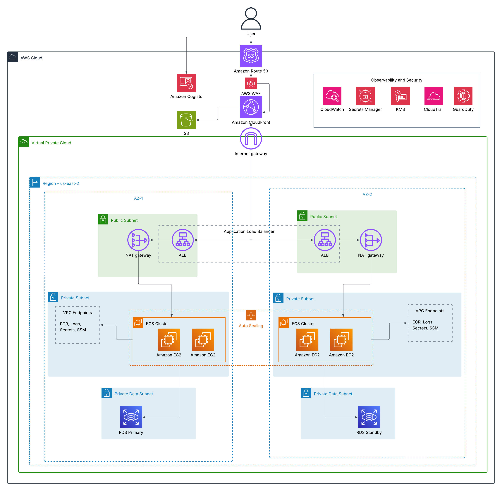

# MaroonLedger 🍁

*A production-grade personal finance platform on AWS — built to develop hands-on expertise across cloud engineering, DevOps, security, and networking.*

**MaroonLedger** is an end-to-end cloud engineering project: a multi-tenant personal finance application deployed on AWS with Terraform. Users authenticate through Cognito, each user's data is scoped to their own identity, and Claude on Amazon Bedrock categorises transactions, flags anomalies, and generates spending insights.

- Screenshots of the working app are in [`docs/images/`](docs/images/)
- [`docs/infrastructure.md`](docs/infrastructure.md) is a service-by-service account of the architecture, the reasoning behind each choice, and what was deliberately left out
- [`docs/devlog.md`](docs/devlog.md) is the development journal — debugging, dead ends, and decisions

---

## Running it locally

The full stack runs locally with no AWS account and no credentials. Authentication is **fully enabled** — there is no local bypass. Tokens come from a small development identity provider instead of Cognito, and the API validates them through exactly the same code path it uses in production.

```bash
cd app
docker compose up --build          # Postgres, dev identity provider, API, frontend
```

Open **http://localhost:3001** and sign in with any username. No Node, Go, or Postgres installation is needed — the four services are containerised, and edits to `frontend/src` hot-reload into the running container.

The AI features run against a deterministic local provider, so every surface works offline and costs nothing.

### Testing the production bundle

The dev server is forgiving in ways a real web server is not. To exercise the actual production build — minified, served by nginx, with the same static-vs-`/api` split CloudFront performs in AWS:

```bash
docker compose --profile prod up --build    # adds nginx on http://localhost:8080
```

This is what catches problems that exist only in the production bundle: a missing `REACT_APP_*` variable, or SPA routing that works under the dev server's catch-all but not under a real server.

### Using real Bedrock inference

```bash
export AWS_PROFILE=your-profile    # or AWS_ACCESS_KEY_ID / AWS_SECRET_ACCESS_KEY
AI_PROVIDER=bedrock docker compose up --build
```

Requires Bedrock model access enabled in your account for the target region. Everything else is unchanged — the only difference is which `ai.Provider` implementation is constructed at startup.

### Tests

```bash
cd app && go test ./...
```

Covers JWT verification (including `alg=none`, foreign signing keys, ID-token replay, and wrong-audience rejection), the category allowlist that contains prompt injection, and the stub AI provider.

---

## Architecture



*The diagram predates the Cognito and Bedrock work; `docs/infrastructure.md` is the current reference.*

| Layer | Components |
|---|---|
| **Edge** | Route 53, CloudFront, ACM, WAF, S3 static hosting |
| **Identity** | Cognito user pool, hosted UI, PKCE, JWT verification |
| **Network** | VPC, 3-tier subnets across 2 AZs, NAT, VPC endpoints |
| **Compute** | ALB, ECS Fargate, separate execution and task IAM roles |
| **Data** | RDS PostgreSQL Multi-AZ, Secrets Manager, KMS CMK |
| **AI** | Claude on Amazon Bedrock |
| **Observability** | CloudWatch alarms, SNS, CloudTrail, GuardDuty, AWS Config |

Several components are gated behind variables because they cost real money — DNS/TLS, VPC endpoints, NAT-per-AZ, and Cognito threat protection. The stack applies and runs with all of them off. See the defaults table at the top of [`docs/infrastructure.md`](docs/infrastructure.md).

---

## What the AI layer does

Three features, all behind a single `ai.Provider` interface with two implementations — Bedrock, and a deterministic local stub. The application never branches on which is in use.

- **Transaction categorisation.** Leave the category blank and the description is classified into one of twelve categories on write.
- **Anomaly detection.** Each transaction is scored against the account's historical behaviour, with a severity and a plain-language reason.
- **Spending insights.** A natural-language summary with observations and recommendations, generated from aggregated category totals.

Two things shaped the design more than the features themselves:

**Prompt injection is in the threat model.** Transaction descriptions are user-controlled text that reaches a prompt. The defence is not prompt wording — it is that model output is never trusted. Categories are constrained by a JSON schema and then re-validated against a closed allowlist in Go; severities default to `none`; nothing the model returns drives a privileged action.

**Enrichment is best-effort.** Categorisation and anomaly detection run concurrently under a deadline, and any failure is logged and dropped rather than failing the user's write. The insights endpoint is the one place the model is a hard dependency, and it reports a 503 honestly rather than inventing a summary.

---

## Tech Stack

**Infrastructure** — Terraform (module-based), AWS
**Backend** — Go 1.25, PostgreSQL 16, Docker (multi-stage, non-root)
**Frontend** — React 19
**AI** — Claude on Amazon Bedrock via the Anthropic Go SDK
**Tooling** — AWS CLI, Git, tmux, nvim

---

## Security

The reasoning behind each control is in [`docs/infrastructure.md`](docs/infrastructure.md#security-model). In brief:

- **Per-user data scoping enforced in the query.** Transactions carry no owner of their own; ownership is always established by joining through the account, so guessing an ID cannot reach another user's data. Foreign resources return 404, not 403.
- **JWT verification** pins RS256 (blocking `alg=none`), requires `token_use=access` so an ID token cannot be replayed as an API credential, and checks `client_id` so a token minted for another app client in the same pool is rejected.
- **No auth bypass flag exists in the server.** Local development uses a real identity provider rather than a disabled check.
- **Security group chaining** — each tier admits only the tier above it, with the ALB restricted to CloudFront's managed prefix list so the WAF cannot be bypassed.
- **RDS-managed master password**, rotated natively. The previous approach wrote a Terraform-generated password into state in plaintext.
- **Separate ECS execution and task roles**, so application code cannot borrow the agent's permissions. Bedrock access is scoped to Anthropic models in-region, not `*`.
- **Per-identity rate limiting** on the endpoints that cost money per call.

Known weaknesses are documented rather than omitted — see [Deliberately Not Implemented](docs/infrastructure.md#deliberately-not-implemented).


---

## Data pipeline

A streaming analytics layer alongside the transactional database: committed
transactions are emitted to Kinesis Firehose, land in an S3 lake as raw JSON, are
folded nightly into columnar Parquet by a Glue PySpark job, and are queried from
Athena.

**It is off by default.** With `DATA_PIPELINE=off` the application constructs a
no-op emitter and behaves exactly as it did before — no AWS calls, no
credentials needed, no cost.

### Architecture

```
  POST /api/accounts/{id}/transactions
             │
             ▼
   ┌──────────────────────┐
   │  Go API (ECS task)   │   row committed to RDS first
   │                      │   then one event emitted, async
   │  internal/pipeline   │   bounded buffer, drop on backpressure
   └──────────┬───────────┘
              │  PutRecordBatch          ← task role, this stream only
              ▼
   ┌──────────────────────┐
   │  Kinesis Firehose    │   Direct PUT · buffers 128 MB / 300 s
   │  (no idle cost)      │   gzip, newline-delimited JSON
   └──────────┬───────────┘
              │
              ▼
   s3://<project>-datalake/
     raw/yyyy/MM/dd/…            ← landing zone, expires after 30 days
     errors/…                    ← records Firehose could not deliver
              │
              │  nightly 03:00 UTC, EventBridge Scheduler
              ▼
   ┌──────────────────────┐
   │  Glue PySpark ETL    │   2 × G.1X · 15 min timeout · bookmarks on
   │  transactions_etl.py │   dedupes by id, normalises, repartitions
   └──────────┬───────────┘
              │
              ▼
     curated/event_date=…/category=…/   ← Snappy Parquet, → IA after 90 days
              │
              ▼
   ┌──────────────────────┐
   │  Athena workgroup    │   partition projection — no crawler, no MSCK
   │  1 GiB scan cap      │   results expire after 30 days
   └──────────────────────┘
```

### Event schema

One event per committed transaction. The emitter sends **only** these fields:

| Field | Type | Notes |
|---|---|---|
| `id` | `bigint` | Transaction primary key |
| `timestamp` | `string` (RFC 3339) | When the transaction occurred, not when ingested |
| `amount` | `double` | Signed; negative is money leaving |
| `category` | `string` | From the closed set in `internal/ai` |
| `ai_provider` | `string` | `bedrock`, `stub`, or omitted |
| `anomaly_severity` | `string` | `none` / `low` / `medium` / `high`, or omitted |

**What is deliberately not emitted:** the free-text `description`, the account
id, the owning user, and `anomaly_reason`. This is the same data-minimisation
posture as the Bedrock integration — the analytics layer needs shape and
magnitude, not the merchant name. A test in `internal/pipeline` asserts the
event has exactly six fields and fails if a description or account identifier
ever appears.

In the curated table `event_date` and `category` are **partition keys**, so they
are encoded in the S3 key rather than stored in the Parquet files.

### Enabling it

Two stacks, applied in order. The data stack is independent and safe to leave
running; the compute stack is the destroyable one.

```bash
# 1. Data stack — serverless, no idle cost
cd infrastructure/environments/data
terraform init && terraform apply

# 2. Wire the outputs into the compute stack
cd ../dev
terraform apply \
  -var 'data_pipeline=firehose' \
  -var "data_pipeline_stream_arn=$(terraform -chdir=../data output -raw firehose_stream_arn)" \
  -var "data_pipeline_stream_name=$(terraform -chdir=../data output -raw firehose_stream_name)"
```

The application reads two environment variables, both set by the ECS task
definition:

| Variable | Default | Effect |
|---|---|---|
| `DATA_PIPELINE` | `off` | `firehose` enables emission |
| `DATA_PIPELINE_STREAM` | — | Delivery stream name; required when enabled |

To turn it off again, re-apply the compute stack with `-var 'data_pipeline=off'`.
The task role loses its Firehose permission and the app reverts to the no-op
emitter.

### Destroy / redeploy workflow

The two stacks share no state — separate root modules, separate backend keys, no
`terraform_remote_state` between them. That is what makes this safe:

```bash
# Tear down everything with an hourly floor (NAT, RDS, Fargate, ALB).
cd infrastructure/environments/dev
terraform destroy          # the lake, catalog and stream are untouched

# Later, bring compute back. Historical data is still queryable throughout.
terraform apply
```

The data stack survives because the compute stack has no record of it to
destroy. Athena queries keep working while compute is down — the lake does not
depend on the application being up.

### Cost posture

Nothing in the data stack bills while idle:

| Service | Idle cost | Charged on |
|---|---|---|
| Firehose (Direct PUT) | **$0** | GB ingested |
| S3 lake | **$0** empty | GB stored |
| Glue job | **$0** | DPU-second while running (~2 min/night) |
| Glue Data Catalog | **$0** | First million objects free |
| Athena | **$0** | $5/TB scanned, capped at 1 GiB per query |
| EventBridge Scheduler | **$0** | Per invocation (~30/month) |
| Budgets | **$0** | Free |

Deliberate choices behind that:

- **Firehose, not Kinesis Data Streams.** Data Streams bills per shard-hour
  whether or not anything is written — roughly $11/month per shard as a floor.
  Firehose Direct PUT has no floor.
- **No Glue crawler.** Partition projection describes the layout
  deterministically, so nothing has to run for a new day to become queryable.
- **Timestamp-prefix partitioning, not Firehose Dynamic Partitioning.** See the
  note in `modules/firehose/main.tf` — the feature carries a per-GB surcharge for
  something the free timestamp namespace already does for ingest date.
- **SSE-S3, not the RDS customer-managed KMS key.** KMS bills per request, and a
  Glue run issues a decrypt per object.
- **Lifecycle everywhere.** Raw expires at 30 days, curated moves to
  Standard-IA at 90, Athena results expire at 30.
- **A 1 GiB per-query scan cap**, enforced at the workgroup so a client cannot
  override it. One careless `SELECT *` fails instead of scanning the lake.

Excluded on cost grounds: Redshift, MSK/Kafka, SageMaker endpoints, Glue
crawlers, QuickSight.

### Querying

```sql
-- Partition-pruned: reads only the last 30 days of partitions.
SELECT category, count(*) AS txns, round(sum(amount), 2) AS net
FROM maroon_ledger_analytics.transactions
WHERE event_date >= current_date - interval '30' day
GROUP BY category
ORDER BY abs(sum(amount)) DESC;
```

Always filter on `event_date` — without it Athena scans every partition, which
is what the scan cap exists to stop.

---

## CI/CD

Built as a separate repository: a GitHub Actions pipeline automating build, push, deploy, and CloudFront invalidation.
