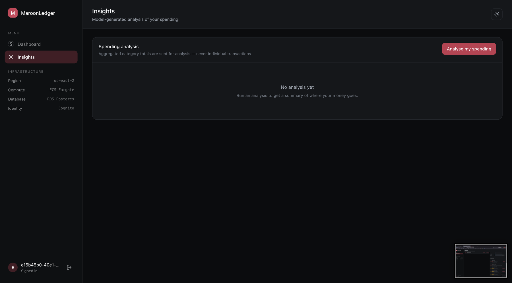

# MaroonLedger

A personal finance app running on AWS. Users sign in through Cognito, each
person's data is scoped to their own identity, and Claude on Bedrock
categorises transactions, flags unusual ones, and writes a spending summary.


## The story

I started this in April 2026 to learn cloud engineering by building something
real instead of following tutorials. I built the infrastructure first: seven
layers of Terraform modules covering network, data, compute, edge, identity and
observability. The first `terraform apply` came back with 72 resources. Then I
wrote a Go API to put on top of it, containerised it, deployed it, took
screenshots, and called it finished.

I picked it up again in August before recruiting season, expecting to polish the
UI. The first read-through of my own code found something worse. My
infrastructure doc described a Cognito identity layer and an ECS-on-EC2 cluster.
Neither existed. The API was open CRUD with no authentication at all — anyone
who found the URL could read and write every account in the database.

So the second half of this project is mostly about closing that gap. Real token
verification, per-user data scoping enforced in SQL, an AI layer with prompt
injection in its threat model, a redesigned frontend, and a streaming analytics
pipeline alongside the transactional database. Along the way I found a spending
figure that disagreed with itself by $1,800 and a Dockerfile that shipped the
wrong binary. Both are written up below, because the bugs are the interesting
part.

## What it does

Three accounts, ninety days of transactions, and a dashboard over the top.

Every transaction gets classified into one of twelve categories on write, and
scored against the account's own history. Anything unusual lands here with a
severity and a plain-language reason:


Insights are generated on demand rather than on page load. Inference costs money
per call, so nothing runs until you press the button:



The request sends aggregated category totals, never individual transactions, and
comes back with observations and recommendations:


The category breakdown underneath is the exact input the analysis was based on,
so you can check its arithmetic:


## Architecture


I drew this in Lucidchart on day one, before writing any Terraform, and it
shaped the module layout that followed. It predates the identity, AI and
analytics work, so treat it as the network and compute picture rather than the
current one. `docs/infrastructure.md` is the reference that is kept accurate.

| Layer | What's in it |
|---|---|
| Edge | CloudFront, S3 static hosting, ACM, Route 53, WAF |
| Identity | Cognito user pool, hosted UI, PKCE, JWT verification in the API |
| Network | VPC, three-tier subnets across two AZs, NAT, VPC endpoints |
| Compute | ALB, ECS Fargate, separate execution and task IAM roles |
| Data | RDS PostgreSQL, Secrets Manager, KMS |
| AI | Claude on Amazon Bedrock |
| Analytics | Kinesis Firehose, S3 lake, Glue PySpark, Athena |
| Observability | CloudWatch alarms, SNS, CloudTrail, GuardDuty, AWS Config |

Sixteen Terraform modules across two independent root stacks. The compute stack
has an hourly cost floor and is meant to be destroyed between demos. The data
stack costs nothing while idle and stays up. They share no state, which is what
makes destroying one safe.

Anything that costs real money is behind a variable that defaults to the
production-correct value: DNS and TLS, VPC endpoints, NAT per AZ, Cognito threat
protection, GuardDuty, WAF, RDS Multi-AZ. The stack applies and runs with all of
them off.

`docs/infrastructure.md` goes service by service, including what I left out and
why. `docs/devlog.md` is the running journal — debugging, dead ends, and the
things I got wrong the first time.

## Decisions worth explaining

**The JWT verifier was written before Cognito was.** It takes an issuer and a
JWKS URL rather than anything Cognito-specific. That one choice is what let me
build `cmd/devidp`, a small local identity provider, so local development runs
the same verification path as production instead of a disabled check. There is
no `AUTH_DISABLED` flag anywhere in the server. A bypass that exists in the code
is a bypass that can ship.

Beyond checking the signature and expiry, three things matter and all three have
negative tests: pinning RS256 stops `alg=none` and HMAC key confusion, requiring
`token_use=access` stops an ID token being replayed as an API credential, and
checking `client_id` matters because a valid signature only proves the pool
minted the token, not that it minted it for this app.

**Transactions have no owner column.** Ownership is established by joining
through the account that holds them, so there is exactly one place per-user
scoping can be got wrong instead of one per table. Someone else's account ID
returns 404 rather than 403, because a 403 confirms the ID is real.

**Model output is never trusted.** Transaction descriptions are user-controlled
text that ends up in a prompt, so prompt injection is in the threat model. The
control is not how the system prompt is worded. The JSON schema constrains what
the model can return, but it's enforced on the far side of a network call, so
the category comes back and gets re-validated against a closed allowlist in Go.
I tested it with a real injection attempt in a description. It landed as
category `other`, which is the containment working.

**Enrichment is best-effort.** Categorisation and anomaly detection run under a
deadline and failures are logged and dropped. Neither is worth failing someone's
write over. The insights endpoint is the one place the model is a hard
dependency, and it returns 503 rather than inventing a summary.

**The AI provider is an interface with two implementations**, Bedrock and a
deterministic stub. The stub isn't a fallback, it's a stand-in: the whole app
works with no AWS account, and the logic is testable without mocking a network
service. Every result records which provider produced it, so stub output can't
be mistaken for inference.

## Two bugs worth reading about

**The dashboard and the insights page disagreed by $1,800.** One said $10,812 of
spending, the other said $9,012, and the category bars summed to the smaller
number. Both pages were right about their own arithmetic. The query underneath
them summed the signed amount per category, so any category with movement in
both directions reported the difference. Three $600 transfers into savings
cancelled most of a $2,400 outbound wire, and the category claimed $600 of
spending while the anomaly panel three inches away flagged the $2,400 wire it
had just erased.

What makes this one worth keeping is that the fix already existed. The function
computing total inflow and outflow had been corrected weeks earlier and carried
a comment explaining exactly why per-category nets can't be reused. It had never
been applied to the query above it, or to the third copy of the same query in
the insights handler. Category totals now come from negative rows only, income
drops out in SQL rather than being filtered by every consumer, and the three
queries are one function.

**A plain `docker build` shipped the wrong binary.** The Dockerfile built two
targets: the API server and the local dev identity provider, the one that issues
tokens to anyone. `docker build .` with no `--target` builds whichever stage
comes last, and the dev IdP was last. A comment at the top of the file asserted
the opposite — that a plain build "can never ship it."

I pushed that image to ECR. It listened on 9000, the target group probes 3000,
so it failed every health check and never received traffic. The failure was loud
only because the ports disagreed. Stage order is now the mechanism: the server
is last, so the default target is the safe one, and shipping the dev IdP takes a
deliberate `--target devidp` that only docker-compose does.

## Running it locally

No AWS account and no credentials. Authentication is fully on — tokens come from
the dev identity provider instead of Cognito and go through the same verifier.

```bash
cd app
docker compose up --build
```

Open http://localhost:3001 and sign in with any username. The AI features run
against the stub, so every screen works offline and costs nothing.

To exercise the real production bundle — minified, served by nginx, with the
same static-vs-`/api` split CloudFront does in AWS:

```bash
docker compose --profile prod up --build   # nginx on http://localhost:8080
```

That's what catches problems which only exist in the production build, like a
missing `REACT_APP_*` variable or SPA routing that works under the dev server's
catch-all but not under a real one.

Against real Bedrock:

```bash
export AWS_PROFILE=your-profile
AI_PROVIDER=bedrock docker compose up --build
```

Tests:

```bash
cd app && go test ./...
```

Nineteen tests across three packages, covering JWT verification and its negative
cases, the category allowlist that contains prompt injection, the anomaly
baseline logic, and the analytics event schema.

## Security

Reasoning for each control is in `docs/infrastructure.md`. The short version:

- Per-user scoping enforced in the query, through the account join.
- RS256 pinned, `token_use` and `client_id` both checked, all with negative tests.
- No auth bypass flag in the server.
- Security group chaining, with the ALB restricted to CloudFront's managed
  prefix list so the WAF can't be bypassed by hitting the ALB directly.
- RDS-managed master password, rotated natively. The earlier version wrote a
  Terraform-generated password into state in plaintext.
- Separate ECS execution and task roles, so application code can't borrow the
  agent's permissions. Bedrock access is scoped to Anthropic models, not `*`.
- Per-identity rate limiting on the endpoints that cost money per call.
- User-supplied categories are rejected rather than coerced, and a CHECK
  constraint backs the allowlist at the database.

Known weaknesses are documented rather than left out. See "Deliberately Not
Implemented" in `docs/infrastructure.md`.

## Data pipeline

Committed transactions are emitted to Kinesis Firehose, land in S3 as raw JSON,
get folded nightly into Parquet by a Glue PySpark job, and are queried from
Athena. It's off by default: with `DATA_PIPELINE=off` the app builds a no-op
emitter, makes no AWS calls, and costs nothing.

The event carries six fields — id, timestamp, amount, category, AI provider, and
anomaly severity. It deliberately does not carry the description, the account
ID, the owning user, or the anomaly reason. The analytics layer needs shape and
magnitude, not the merchant name. A test asserts the event has exactly those six
fields and fails if a description or account identifier ever appears.

Full walkthrough, schema, cost breakdown and query examples:
`docs/data-pipeline.md`.

## Known limitations

- **Bedrock inference quota in my sandbox account is zero for every Claude model
  in every region.** The integration is real and the code path is exercised by
  `cmd/bedrockcheck`, but the screenshots above were produced by the stub. The
  provider is recorded on every result, which is why the insights page says
  "analysed by stub" rather than pretending otherwise.
- The access token is held in `sessionStorage`. A backend-for-frontend holding
  it in an httpOnly cookie is the real fix.
- `GET /api/summary` has no rate limit. The endpoints that cost money do.
- The architecture diagram predates the Cognito, Bedrock and analytics work.
- The account is a vended sandbox with SCPs that block Firehose, GuardDuty and
  CloudFront-scope WAF, and pin every region to us-east-2. Those are variables
  defaulting to on, overridden only in gitignored tfvars.

## CI/CD

A separate repository: GitHub Actions building the image, pushing to ECR,
deploying to ECS, and invalidating CloudFront.
