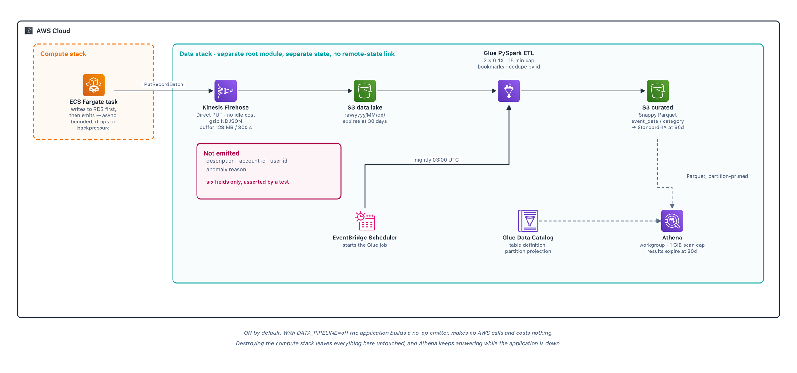

# Data pipeline

A streaming analytics layer running alongside the transactional database.
Committed transactions are emitted to Kinesis Firehose, land in an S3 lake as
raw JSON, are folded nightly into columnar Parquet by a Glue PySpark job, and
are queried from Athena.

It is off by default. With `DATA_PIPELINE=off` the application constructs a
no-op emitter and behaves exactly as it did before: no AWS calls, no credentials
needed, no cost. Enabling it is explicit, the same posture as the AI provider.

## Shape



```
  POST /api/accounts/{id}/transactions
             │
             ▼
   ┌──────────────────────┐
   │  Go API (ECS task)   │   row committed to RDS first
   │                      │   then one event emitted, async
   │  internal/pipeline   │   bounded buffer, drop on backpressure
   └──────────┬───────────┘
              │  PutRecordBatch          ← task role, this stream only
              ▼
   ┌──────────────────────┐
   │  Kinesis Firehose    │   Direct PUT · buffers 128 MB / 300 s
   │  (no idle cost)      │   gzip, newline-delimited JSON
   └──────────┬───────────┘
              │
              ▼
   s3://<project>-datalake/
     raw/yyyy/MM/dd/…            ← landing zone, expires after 30 days
     errors/…                    ← records Firehose could not deliver
              │
              │  nightly 03:00 UTC, EventBridge Scheduler
              ▼
   ┌──────────────────────┐
   │  Glue PySpark ETL    │   2 × G.1X · 15 min timeout · bookmarks on
   │  transactions_etl.py │   dedupes by id, normalizes, repartitions
   └──────────┬───────────┘
              │
              ▼
     curated/event_date=…/category=…/   ← Snappy Parquet, → IA after 90 days
              │
              ▼
   ┌──────────────────────┐
   │  Athena workgroup    │   partition projection, no crawler
   │  1 GiB scan cap      │   results expire after 30 days
   └──────────────────────┘
```

The database write happens first and the emit is asynchronous behind a bounded
channel. If the buffer is full the event is dropped rather than blocking the
request. Analytics telemetry is not worth making someone's transaction slower,
and it is certainly not worth failing the write.

## Event schema

One event per committed transaction. The emitter sends only these fields:

| Field | Type | Notes |
|---|---|---|
| `id` | `bigint` | Transaction primary key |
| `timestamp` | `string` (RFC 3339) | When the transaction occurred, not when ingested |
| `amount` | `double` | Signed; negative is money leaving |
| `category` | `string` | From the closed set in `internal/ai` |
| `ai_provider` | `string` | `bedrock`, `stub`, or omitted |
| `anomaly_severity` | `string` | `none` / `low` / `medium` / `high`, or omitted |

What is deliberately not emitted: the free-text `description`, the account ID,
the owning user, and `anomaly_reason`. This is the same data-minimization
posture as the Bedrock integration. The analytics layer needs shape and
magnitude, not the merchant name or who spent it.

A test in `internal/pipeline` asserts the event has exactly six fields and fails
if a description or account identifier ever appears. That is a cheap way to stop
a future "just add the description, it'd be useful for grouping" from quietly
turning an aggregate store into a PII store.

In the curated table `event_date` and `category` are partition keys, so they are
encoded in the S3 key rather than stored inside the Parquet files.

## Enabling it

Two stacks, applied in order. The data stack is independent and safe to leave
running. The compute stack is the destroyable one.

```bash
# 1. Data stack: serverless, no idle cost
cd infrastructure/environments/data
terraform init && terraform apply

# 2. Wire the outputs into the compute stack
cd ../dev
terraform apply \
  -var 'data_pipeline=firehose' \
  -var "data_pipeline_stream_arn=$(terraform -chdir=../data output -raw firehose_stream_arn)" \
  -var "data_pipeline_stream_name=$(terraform -chdir=../data output -raw firehose_stream_name)"
```

The outputs are wired by hand rather than through `terraform_remote_state`.
Reading the other stack's state would couple them, and coupling is exactly what
must not exist if destroying the compute stack is to leave the lake untouched.

The application reads two environment variables, both set by the ECS task
definition:

| Variable | Default | Effect |
|---|---|---|
| `DATA_PIPELINE` | `off` | `firehose` enables emission |
| `DATA_PIPELINE_STREAM` | none | Delivery stream name; required when enabled |

To turn it off, re-apply the compute stack with `-var 'data_pipeline=off'`. The
task role loses its Firehose permission and the app reverts to the no-op
emitter.

## Destroy and redeploy

The two stacks share no state: separate root modules, separate backend keys, no
`terraform_remote_state` between them.

```bash
# Tear down everything with an hourly floor (NAT, RDS, Fargate, ALB).
cd infrastructure/environments/dev
terraform destroy          # the lake, catalog and stream are untouched

# Later, bring compute back. Historical data is queryable the whole time.
terraform apply
```

The data stack survives because the compute stack has no record of it to
destroy. Athena queries keep working while compute is down, because the lake
does not depend on the application being up.

## Cost

Nothing in the data stack bills while idle:

| Service | Idle cost | Charged on |
|---|---|---|
| Firehose (Direct PUT) | $0 | GB ingested |
| S3 lake | $0 empty | GB stored |
| Glue job | $0 | DPU-second while running (~2 min/night) |
| Glue Data Catalog | $0 | First million objects free |
| Athena | $0 | $5/TB scanned, capped at 1 GiB per query |
| EventBridge Scheduler | $0 | Per invocation (~30/month) |
| Budgets | $0 | Free |

The choices behind that:

- **Firehose, not Kinesis Data Streams.** Data Streams bills per shard-hour
  whether or not anything is written, roughly $11/month per shard as a floor.
  Firehose Direct PUT has no floor.
- **No Glue crawler.** Partition projection describes the layout
  deterministically, so nothing has to run for a new day to become queryable.
- **Timestamp-prefix partitioning, not Firehose Dynamic Partitioning.** Dynamic
  Partitioning carries a per-GB surcharge for something the free timestamp
  namespace already does for ingest date.
- **SSE-S3, not the RDS customer-managed KMS key.** KMS bills per request and a
  Glue run issues a decrypt per object.
- **Lifecycle rules everywhere.** Raw expires at 30 days, curated moves to
  Standard-IA at 90, Athena results expire at 30.
- **A 1 GiB per-query scan cap**, enforced at the workgroup so a client cannot
  override it. One careless `SELECT *` fails instead of scanning the lake.

Excluded on cost grounds: Redshift, MSK, SageMaker endpoints, Glue crawlers,
QuickSight.

## Querying

```sql
-- Partition-pruned: reads only the last 30 days of partitions.
SELECT category, count(*) AS txns, round(sum(amount), 2) AS net
FROM maroon_ledger_analytics.transactions
WHERE event_date >= current_date - interval '30' day
GROUP BY category
ORDER BY abs(sum(amount)) DESC;
```

Always filter on `event_date`. Without it Athena scans every partition, which is
what the scan cap exists to stop.

## The Glue job's one gotcha

`transactions_etl.py` originally called `sys.exit(0)` when the bookmark found no
new records. Glue treats any `SystemExit` as a job failure, so a night with no
new transactions was reported as FAILED. The job now branches instead and
reaches a single `job.commit()` on both paths.
